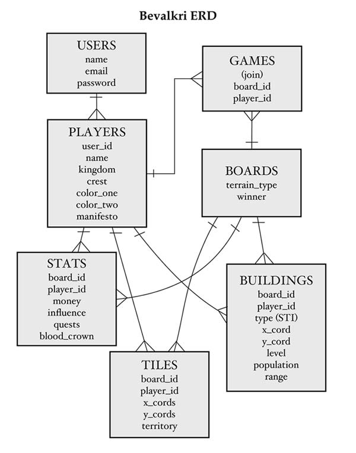

#Bevalkyri

The description of the project...

+ Link to Github Repo: https://github.com/RDFroeber/bevalkyri
+ Link to Heroku App: http://bevalkyri.herokuapp.com/
+ Ruby version: 2.0.0
+ System dependencies
  * Backaid: Underscore.js and Backbone.js `rails g backaid`
+ Configuration
`bundle install`
+ Database creation
  * Add a database.yml file...
  * `rake db:create`
+ Database initialization
  * `rake db:migrate`  
+ How to run the test suite
  * Use `rake db:migrate RAILS_ENV=test` to migrate your test environment
  * Use `rspec` to run the rspec test suite
  * Use `rake jasmine` to run the jasmine test suite

## Data Model

## User Stories
**As a User**

1. I want to create a new player so that I can play a game as that player.

2. I want to create a new game so that I can start playing from the beginning.
  * There are Tiles (spaces)
  * There is a Castle (place to start/starter territory)
  * The Tiles surrounding my Castle are filled in (part of my territory)
  * I can build a house on any vertex my existing territory touches
  * When I build a house the surrounding territory fills in (is now mine)
  * I can see my players attributes (Population, Houses, Quests, and Money)
  * My money increments over time
  * Money decreases when I buy a house

3. I want to play a game so that I procrastinate whatever else I am supposed to be doing.
  * My Castle is placed somewhere on the Board
  * I start with a set amount of money that I can use to buy houses
  * The more territory and houses I own, the more money I earn
  * I can buy Quests with my money and people
  * Quest can return with more money or less(debt), more or less people, and sometimes the *Blood Crown*
  * I win the game when I find the *Blood Crown*

4. I want to save an existing player profile so that I can play as that player whenever I want.

5. I want to select an existing player profile to play a game so that I can immediately start playing.

6. I want to delete an existing player profile so that I erase persisted personas of myself from the world of Bevalkyri.

7. I want to see my current game statistics so that I know how I am doing.

8. I want to create an account so that my personal information is saved and secure.

9. I want to login to my account so that I can access my personal information.

10. I want to edit my account information so that the digital representation of myself is not forever frozen in time.

### Phase 2

1. I want to save my current game so that I do not loose my progress and can come back to it at a later time.

2. I want to resume a game that I have already started so that I can pick up where I left off.

3. I want to play against other users so that the game is more interesting.

4. I want to play a game continued...
  * An influence catagory is added
  * Players attributes continued (Bases, Influence)
  * I can add a military base to increase my influence
  * I can upgrade my houses to increase the amount of money I earn
  * I can upgrade my military bases to increase their range
  * Influence and bases are required to purchase Quests as well (people no longer needed)
  * Quests can now also increase your influence and military

5. I want to log in with my Facebook account so that I do not need to make another account.